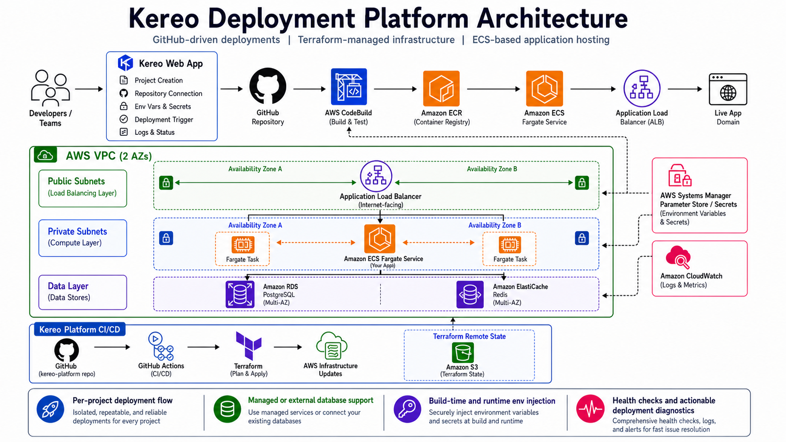
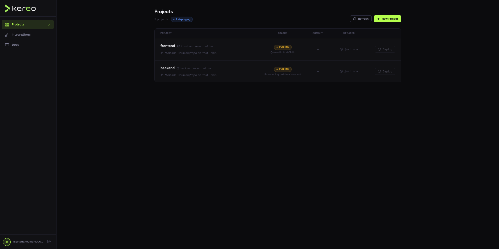
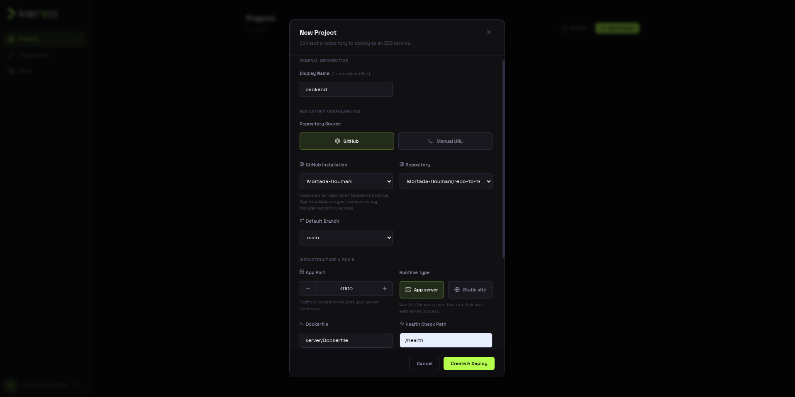
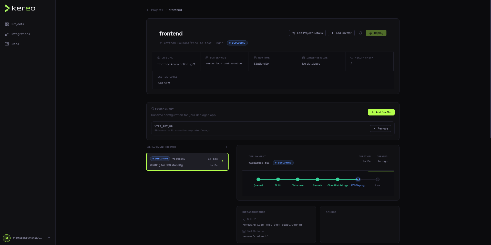
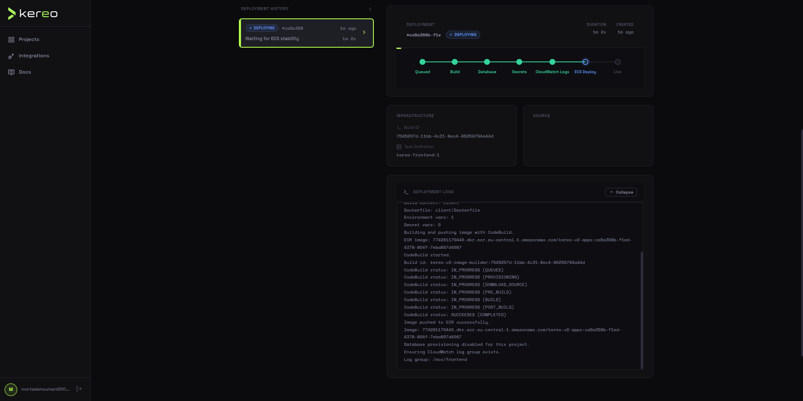
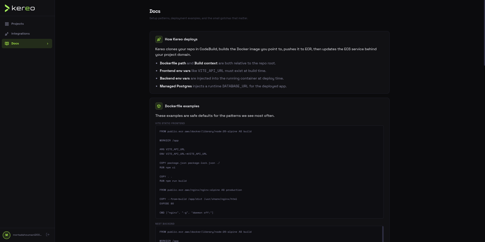
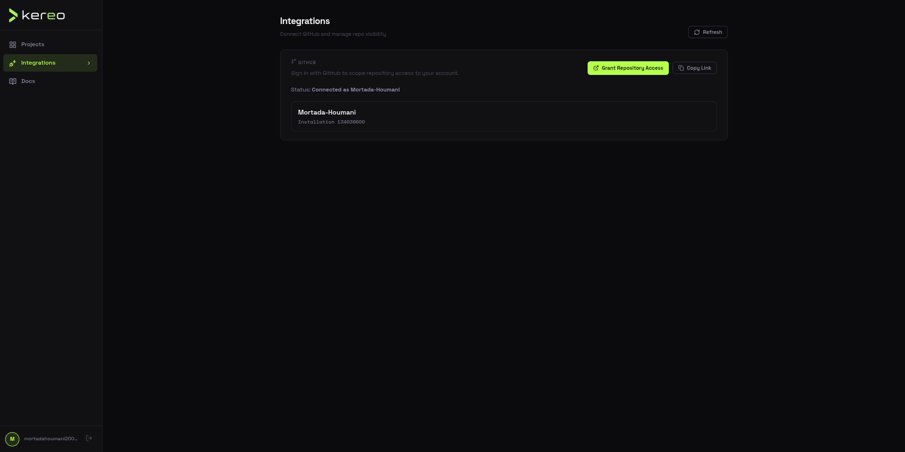

# Kereo

Kereo is a deployment platform for shipping containerized applications to AWS ECS.

It gives users a single place to connect a repository, configure Docker build settings, manage environment variables, choose a database mode, trigger deployments, and inspect logs/status without jumping between AWS consoles.

## Deployment Flow

```text
GitHub repo -> AWS CodeBuild -> Amazon ECR -> ECS/Fargate -> ALB -> live service
```

Kereo's own infrastructure is managed through Terraform:

```text
GitHub Actions -> Terraform -> AWS infrastructure updates
```

Terraform state is stored remotely in S3 so infrastructure changes can run safely from CI.

## Architecture



Kereo provisions and orchestrates the platform pieces around each deployed app:

- AWS ECS/Fargate services and task definitions
- Application Load Balancer routing and health checks
- Amazon ECR image publishing
- AWS CodeBuild image builds
- CloudWatch build and runtime logs
- SSM Parameter Store backed secrets
- Managed or external PostgreSQL configuration
- Redis-backed background deployment processing

## Screenshots

### Projects Dashboard



### Create Project



### Project Details



### Deployment Logs



### Documentation



### GitHub Integration



## Core Features

- **Repository-based deployments**: connect GitHub or use a manual repository URL.
- **Docker build configuration**: set Dockerfile path, build context, app port, health check path, and runtime type.
- **Build-time and runtime environment variables**: support frontend build args like `VITE_API_URL` and backend runtime secrets like `DATABASE_URL`.
- **Database modes**: choose no database, Kereo-managed PostgreSQL, or an external database URL.
- **Deployment tracking**: follow queued, build, push, and ECS rollout states from the project view.
- **Actionable failure messages**: common AWS and Docker failures are translated into clearer next steps.
- **GitHub integration**: connect repositories and trigger deployment workflows from the Kereo dashboard.
- **Infrastructure CI/CD**: Terraform runs through GitHub Actions using remote S3 state.

## Tech Stack

**Application**

- NestJS
- React
- TypeScript
- PostgreSQL
- Redis

**AWS and Infrastructure**

- AWS ECS/Fargate
- Amazon ECR
- AWS CodeBuild
- Application Load Balancer
- CloudWatch
- SSM Parameter Store
- Amazon RDS PostgreSQL
- Amazon ElastiCache Redis
- Terraform
- GitHub Actions

```

## Project Runtime Types

Kereo supports two Dockerized project presets.

**Web server**

- For containers that run their own HTTP server.
- Default port: `3000`
- Common examples: NestJS, Express, FastAPI, Django, Rails

**Static site**

- For static frontend apps served through Nginx or another web server.
- Default port: `80`
- Common examples: React, Vite, Vue, static SPAs

Projects are published on dedicated subdomains

```

## Environment Variables

Kereo separates runtime env vars from build-time env vars.

Runtime variables are injected into the ECS task definition. These are used by backend apps at container startup:

```env
DATABASE_URL=postgresql://...
JWT_SECRET=...
```

Build-time variables are forwarded into Docker builds when marked as exposed to build. This matters for static frontends because Vite reads `VITE_*` variables while the bundle is being built:

```dockerfile
ARG VITE_API_URL
ENV VITE_API_URL=$VITE_API_URL
RUN npm run build
```

## Infrastructure CI/CD

The infrastructure workflow lives in `.github/workflows/infra.yml`.

It runs:

```text
terraform fmt -> terraform init -> terraform validate -> terraform plan -> terraform apply
```

Required GitHub repository variables include:

```text
TF_PROJECT_NAME
TF_FRONTEND_CONTAINER_IMAGE
TF_STATE_BUCKET
TF_STATE_KEY
TF_STATE_REGION
TF_CERTIFICATE_ARN
TF_HOSTED_ZONE_ID
```

Required GitHub secrets include:

```text
AWS_ACCESS_KEY_ID
AWS_SECRET_ACCESS_KEY
TF_DB_PASSWORD
TF_JWT_SECRET
TF_GITHUB_WEBHOOK_SECRET
```

## Production URLs

- Frontend: `https://kereo.online`
- Backend API: `https://kereo.online/api`
- GitHub webhook endpoint: `https://kereo.online/api/webhooks/github`

## What I Learned

Kereo started as a deployment dashboard, but most of the meaningful engineering ended up being in the platform details:

- keeping Terraform state usable from CI
- handling build-time vs runtime configuration
- wiring CodeBuild, ECR, ECS, ALB, SSM, CloudWatch, RDS, and Redis together
- debugging managed database SSL behavior
- making failed deployments explain what the user can do next

The result is a full deployment workflow that behaves much closer to a small platform than a single application.
